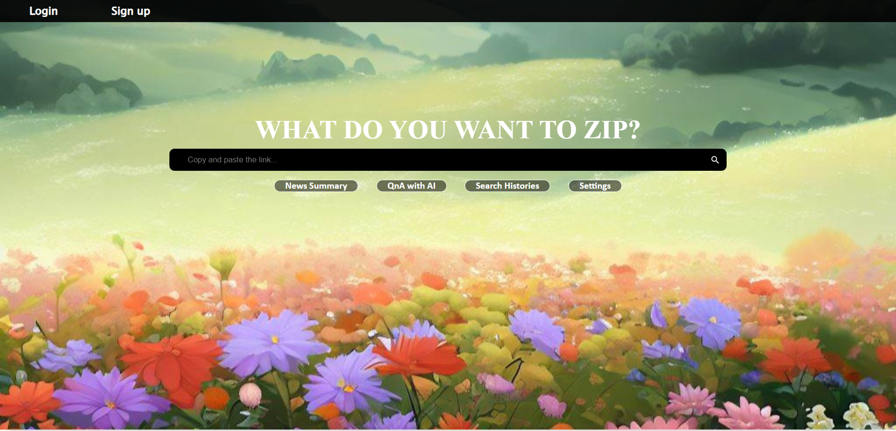

# 🗞️ '뉴스.zip' - 뉴스 요약 서비스

 

<!--  -->
##  해커톤 전사들 

2023 건국대학교 해커톤 '해커톤 전사들' 팀 (김다연, 안준영, 이은찬, 임현성)

프로젝트명 : 
MZ세대를 위한 쉽고 편리한 뉴스 요약 서비스

<!-- TABLE OF CONTENTS -->

  
Table of Contents

  <ol>
    <li>
      <a href="#about-the-project">About The Project</a>
      <ul>
        <li><a href="#built-with">Built With</a></li>
      </ul>
    </li>
    <li><a href="#usage">Usage</a></li>
    <li><a href="#roadmap">Roadmap</a></li>
    <li><a href="#license">License</a></li>
    <li><a href="#references">References</a></li>
    <li><a href="#contributors">Contributors</a></li>
  </ol>

<!-- ABOUT THE PROJECT -->

## About The Project

  
**Main Screen**

**Login Screen**

**WebSite Logo**

**"뉴스에 덜 친숙한 MZ세대에게 사회적 이슈들에 대해 쉽게 접할 수 있도록 도움을 주고자 시작한 프로젝트입니다."**

MZ세대는 
의 릴스, 
의 쇼츠 등 짧지만 핵심적인 내용을 추구하는 경향이 있습니다.

하지만 뉴스 기사들은 내용이 길고, 핵심 내용뿐만 아니라 부가적인 내용도 적혀있어 MZ세대가 뉴스를 친숙하게 여기기엔 이러한 큰 장벽이 존재합니다.

따라서 저희는 MZ세대의 mobile-friendly 한 장점을 활용하면서, 뉴스 내용을 핵심적인 내용으로 요약함으로써 MZ세대의 단점까지 보완해 주는 웹 사이트를 개발했습니다.

- **간결하고 핵심적인 정보로 뉴스를 요약**
  
- **접근성이 좋아 사용하기 용이함**

- **쉽고 빠르게 정보를 찾을 수 있음**

저희 프로젝트명인 NEWS.ZIP의 이러한 특징들은 MZ세대의 단점을 보완해 주면서도, 장점을 부각해 주는 능력을 갖추고 있습니다.

이번 프로젝트를 통하여 많은 MZ세대가 사회적 이슈에 좀 더 친근하게 다가가기를 염원합니다.

## How To Use

1.  
 버튼을 통해 로그인 및 회원가입을 합니다.

2. 검색창에 요약을 원하는 뉴스 기사의 링크를 검색합니다.
   
3. 핵심적이고 간결하게 요약된 기사를 만나보실 수 있습니다.

### Menu

- **News Summary**: AI가 요약한 3~5줄의 뉴스기사가 뜹니다.
  
- **QnA with AI**: 페이지의 하단으로 이동하여 AI에게 질문할 수 있습니다.
  
- **Recent Summaries**: 사용자가 최근에 요약한 뉴스기사들을 불러옵니다.
  
- **Settings**: 사용자가 원하는 배경 이미지를 선택하여 배경화면에 적용시킬 수 있습니다.

## 서비스 소개: "News.Zip" 

- **Description**: MZ세대를 위한 개인적이고 빠른 뉴스 요약 서비스
  
- **Features**:
  - 간결하고 중요한 정보로 뉴스를 요약
    
  - 접근성이 좋아 사용하기 용이
    
  - 편리함을 추구하며 모바일과 친숙하다는 특징을 가진 MZ 세대 겨냥
    
  - 쉽고 빠르게 필요한 정보를 찾을 수 있다는 장점

    
### Built With
| 역할                 | 종류                                                                                                                                                                                                              |
| -------------------- | ----------------------------------------------------------------------------------------------------------------------------------------------------------------------------------------------------------------- |
| front              |                                                                                                                 |
| back |                                    |
| Programming Language |  ,  |
| Data Fetching        |                                                                                                         |   

## Usage

**실제 사용 화면**

    
    
요약을 원하는 뉴스 기사의 링크를 복사합니다.
    

    
  
 Enter or New Summary 버튼을 누르면
    AI가 제목과, 핵심내용만을 요약해 줍니다.

  <p1> QnA with AI에서 "Q:제조일자가 없으면 세균 수 부적합이 나와?" 등의 기사와 관련된
  궁금한 점을 질문합니다. 
    AI는 사용자의 질문에 대한 적절한 해답을 드립니다. </p1>

    
    
이번에는 다른 사이트의 뉴스 기사를 요약해보겠습니다. 마찬가지로 링크를 복사해줍니다.
    

    
  
 AI가 제목과, 핵심내용만을 잘 요약해 주는 것을 확인할 수 있습니다.

  <p1> 또한, QnA with AI에서 궁금한 점을 질문하면 마찬가지로 적절한 해답을 제시합니다. 
   </p1>

  

**Recent Summaries**

앞서 요약한 뉴스들을 다시 보고 싶을 때, Recent Summaries 버튼을 누릅니다.

<p1 style="margin: 0 40px;">최근에 요약한 순서대로 뉴스기사의 링크들이 기록됩니다
    </p1>

**Settings**

    
    
 Settings 버튼을 누를 경우, 다양한 배경 이미지가 뜹니다.
    

    
  
 하나를 선택하여 누를 경우, 실제 배경화면에 적용이 가능합니다.

## Roadmap

## License

This project is licensed under the MIT License - see the [LICENSE](LICENSE) file for details.

## References

- [Book] **Do it! 파이썬 웹 개발부터 배포까지! 점프 투 장고** - 박응용 지음
- [Book] **리액트를 다루는 기술 개정판** - 김민준 지음
- [Repo] [**KoBART :: SKT-AI**](https://github.com/SKT-AI/KoBART)
- [Repo] [**KoBART-summarization :: seujung**](https://github.com/seujung/KoBART-summarization)
- [Data] [문서요약 텍스트](https://www.aihub.or.kr/aihubdata/data/)

## Contributors

|        |     김다연     |     안준영     |     이은찬     |     임현성     |
|:------:|:--------------:|:--------------:|:--------------:|:--------------:|
|  Name  | Dayeon Kim | Junyeong Ahn | Eunchan Lee | Hyunsung Lim |
| Github | [@dayeon1031](https://github.com/dayeon1031) | [@ahnjun0](https://github.com/ahnjun0) | [@Welsee](https://github.com/Welsee) | [@hsung3313](https://github.com/hsung3313) |
|  Email  | rlaekdus1279@naver.com | jyahn.IT@gmail.com | eunchan28@naver.com | hsung3313@gmail.com |
|  Role  | 팀장, Front, 디자인 | 기획, AI, Back | Back | Front |
